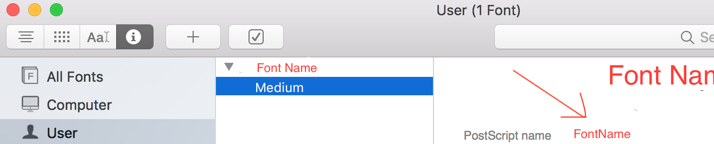

## React Native notes

### Environment notes:

#### Issue with `config.h`:

Such issue like ['config.h' file not found](https://github.com/facebook/react-native/issues/14382)

can be fixed with following steps:

1. `rm -r ~/.rncache`
1. `rm -rf node_modules`
1. `yarn`
1. `cd node_modules/react-native/third-party/glog{version number} && sh ./configure`
1. clear `Derived Data` in Xcode
1. Run build in Xcode


Also, if problems are present only in Xcode version 10 - next point may be useful too 

#### Issue with Xcode 10

Such issue like ['/Users/user/Desktop/projects/project/node_modules/react-native/Libraries/WebSocket/libfishhook.a'](https://github.com/facebook/react-native/issues/19569)

can be fixed for now with setting `Build System` to `Legacy`;

Steps:

* Open XCode -> File -> Project Settings

* Choose `Legacy Build System` in `Build System` dropdown;

### Babel notes:

#### Aliases for imports:

* Add `"babel-plugin-module-resolver": "^3.1.1",` to `devDependencies` in `package.json`;

* run `yarn` or `npm i`

* modify `.babelrc`

```
{
  "presets": ["react-native"],
  "plugins": [
    ["module-resolver", { "cwd": "babelrc", "root": ["./"] } ],
  ],
}

```

#### Decorators support:

In react-native ver. 0.56 there is new ver. of Babel support. Also - there is new standard for decorators;

For react-native ver. < 0.56:

* Add `"babel-plugin-transform-decorators-legacy": "^1.3.5",` to `devDependencies` in `package.json`;

* run `yarn` or `npm i`

* modify `.babelrc`

```
{
  "presets": ["react-native"],
  "plugins": [
    ["module-resolver", { "cwd": "babelrc", "root": ["./"] } ],
    "transform-decorators-legacy"
  ],
}

```


### Layout notes:

#### Custom Fonts:

[Article](https://medium.com/react-native-training/react-native-custom-fonts-ccc9aacf9e5e)

Also may have problems with font namings (works on Android - not on iOS, or reverted). To solve this: we need to know correct font name;

iOS: 

Add this code to `AppDelegate.m` and run application. 

```
for (NSString *familyName in [UIFont familyNames]){
    NSLog(@"Family name: %@", familyName);
    for (NSString *fontName in [UIFont fontNamesForFamilyName:familyName]) {
        NSLog(@"--Font name: %@", fontName);
    }
}
```

Font name listed id `NSLog(@"--Font name: %@", fontName);` is the correct font name on iOS device.

For both platforms:

1. Install Font Book application;
1. Add your font to Font Book;
1. Name, texted in `PostScript name` field - is the correct name of the font;


